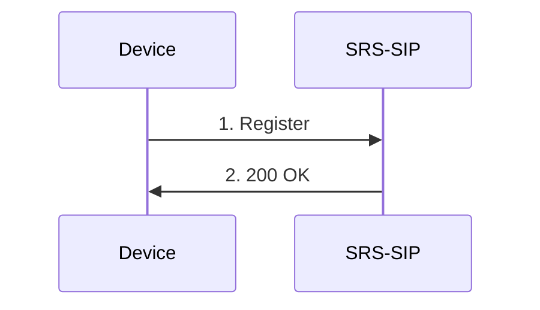
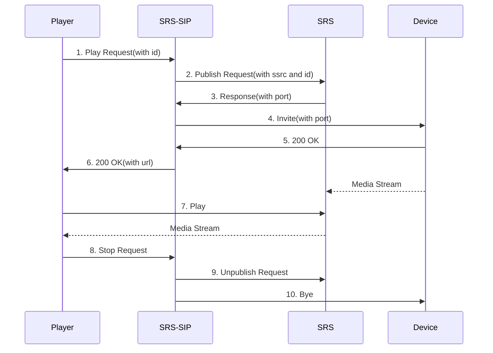

# SRS-SIP

## Usage

Pre-requisites:
- Go 1.23+
- Node 20+

Then run
```
git clone https://github.com/ossrs/srs-sip
cd srs-sip
./build.sh
```

If on Windows
```
./build.bat
```

Run the program:

```
./objs/srs-sip
```

Use docker
```
docker run -id -p 1985:1985 -p 5060:5060 -p 8025:8025 -p 9000:9000 -p 5060:5060/udp -p 8000:8000/udp --name srs-sip --env CANDIDATE=your_ip ossrs/srs-sip:alpha
```

## Sequence

1. 注册流程


暂时没有实现鉴权功能，敬请期待。

2. 播放视频流程
Player、SRS-SIP、SRS Server和GB28181 Device的交互图如下：



1. 通过SRS-SIP提供的API接口`/srs-sip/v1/invite`，Player主动发起播放请求，携带设备的通道ID
2. SRS-SIP向SRS发起推流请求，携带SSRC和ID，SSRC是设备推流时RTP里的字段
3. SRS响应推流请求，并返回收流端口。目前SRS仅支持TCP单端口模式，在配置文件`stream_caster.listen`中配置
4. SRS-SIP通过GB28181协议向设备发起`Invite`请求，携带SRS的收流端口及SSRC
5. 设备响应成功
6. SRS-SIP响应成功，携带URL，用于播放
7. Player通过返回的URL进行拉流播放
8. Player停止播放
9. SRS-SIP通知SRS停止收流
10. SRS-SIP通过设备停止推流
