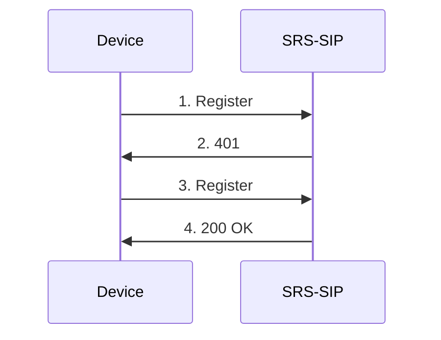
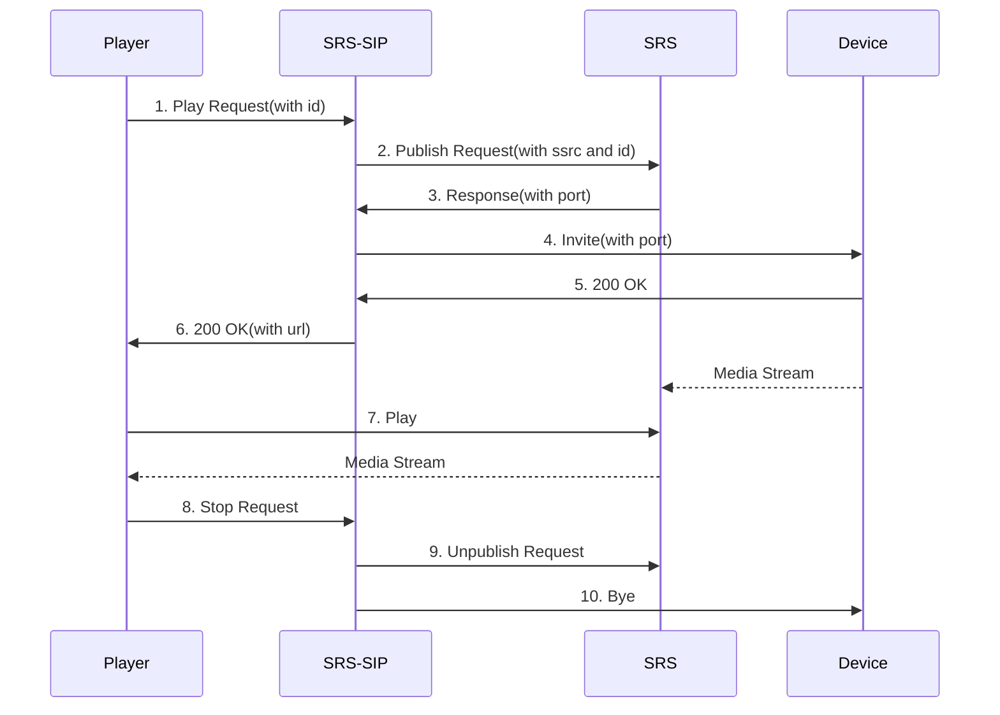

# SRS-SIP

[](https://github.com/ossrs/srs-sip/actions/workflows/ci.yml)
[](https://github.com/ossrs/srs-sip/actions/workflows/codeql.yml)
[](https://codecov.io/gh/ossrs/srs-sip)
[](https://goreportcard.com/report/github.com/ossrs/srs-sip)
[](https://github.com/ossrs/srs-sip/blob/main/LICENSE)

## Usage

Pre-requisites:
- Go 1.23+
- Node 20+

Then run
```
git clone https://github.com/ossrs/srs-sip
cd srs-sip
./build.sh
```

If on Windows
```
./build.bat
```

Run the program:

```
./objs/srs-sip -c conf/config.yaml
```

## Testing

Run all tests:

```bash
go test -v ./pkg/...
```

Run tests with coverage:

```bash
go test ./pkg/... -coverprofile=coverage.out
go tool cover -func=coverage.out
```

For more details, see [Testing Guide](docs/TESTING.md).

## Security

This project uses CodeQL for automated security scanning. For more information about security practices and how to report vulnerabilities, see [Security Guide](docs/SECURITY.md).

## Docker

Use docker
```
docker run -id -p 1985:1985 -p 5060:5060 -p 8025:8025 -p 9000:9000 -p 5060:5060/udp -p 8000:8000/udp --name srs-sip --env CANDIDATE=your_ip ossrs/srs-sip:alpha
```

 - 1985/TCP: SRS监听，SRS-SIP通过此端口调用SRS的API
 - 9000/TCP: SRS监听，用于接收国标推送的媒体流
 - 8000/UDP：SRS监听，用于RTC播放
 - 5060/TCP：SRS-SIP监听，用于国标注册
 - 8025/TCP：SRS-SIP监听，用于前端页面

## Sequence

1. 注册流程


2. 播放视频流程
Player、SRS-SIP、SRS Server和GB28181 Device的交互图如下：



1. 通过SRS-SIP提供的API接口`/srs-sip/v1/invite`，Player主动发起播放请求，携带设备的通道ID
2. SRS-SIP向SRS发起推流请求，携带SSRC和ID，SSRC是设备推流时RTP里的字段
3. SRS响应推流请求，并返回收流端口。目前SRS仅支持TCP单端口模式，在配置文件`stream_caster.listen`中配置
4. SRS-SIP通过GB28181协议向设备发起`Invite`请求，携带SRS的收流端口及SSRC
5. 设备响应成功
6. SRS-SIP响应成功，携带URL，用于播放
7. Player通过返回的URL进行拉流播放
8. Player停止播放
9. SRS-SIP通知SRS停止收流
10. SRS-SIP通过设备停止推流


## API 接口

SRS-SIP 提供了完整的 HTTP API 接口，用于设备管理、视频流控制、PTZ控制等功能。

详细的API接口文档请参考：[API接口文档](doc/API.md)

### 主要功能

- **设备管理**：获取设备列表、通道信息
- **视频流控制**：发起视频邀请、暂停/恢复、调整播放速度
- **PTZ控制**：云台控制（上下左右、缩放）
- **录像查询**：查询历史录像记录
- **媒体服务器管理**：配置和管理媒体服务器

### 快速开始

```bash
# 获取设备列表
curl -X GET "http://localhost:8025/srs-sip/v1/devices"

# 发起视频邀请
curl -X POST "http://localhost:8025/srs-sip/v1/invite" \
  -H "Content-Type: application/json" \
  -d '{
    "device_id": "34020000001320000001",
    "channel_id": "34020000001320000002",
    "media_server_id": 1,
    "play_type": 0
  }'
```
