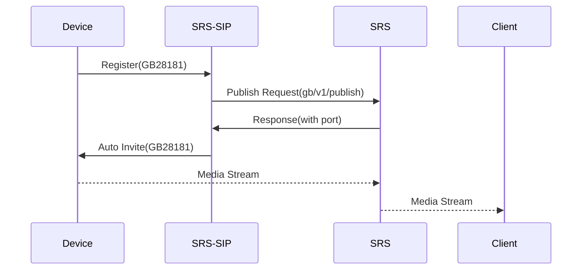

## SRS-SIP

### Sequence

```mermaid
sequenceDiagram
    Device ->> SRS-SIP : Register(GB28181)
    SRS-SIP ->>  SRS : Publish Request(gb/v1/publish)
    SRS ->> SRS-SIP : Response(with port)
    SRS-SIP ->>  Device : Auto Invite(GB28181)
    Device -->> SRS : Media Stream
    SRS -->> Client : Media Stream
```

### Building from source

Pre-requisites:
- Go 1.17+ is installed
- GOPATH/bin is in your PATH

Then run
```
git clone https://github.com/ossrs/srs-sip
cd srs-sip
./bootstrap.sh
mage
```

### Run

```
srs-sip -media-host 127.0.0.1 -media-api-port 1985 -sip-port 5060 
```