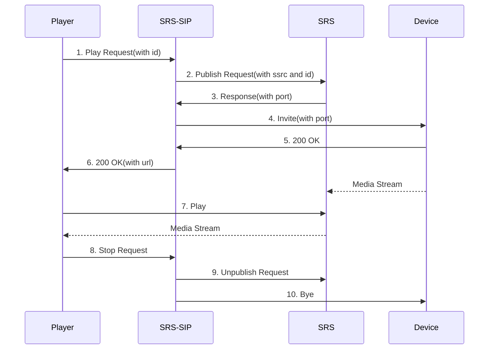

## SRS-SIP

### Sequence

```mermaid
sequenceDiagram
    Player ->> SRS-SIP : 1. Play Request(with id)
    SRS-SIP ->>  SRS : 2. Publish Request(with ssrc and id)
    SRS ->> SRS-SIP : 3. Response(with port)
    SRS-SIP ->>  Device : 4. Invite(with port)
    Device ->> SRS-SIP : 5. 200 OK
    SRS-SIP ->> Player : 6. 200 OK(with url)
    Device -->> SRS : Media Stream
    Player ->> SRS : 7. Play
    SRS -->> Player : Media Stream
    Player ->> SRS-SIP : 8. Stop Request
    SRS-SIP ->> SRS : 9. Unpublish Request
    SRS-SIP ->> Device : 10. Bye
```

1. 通过SRS-SIP提供的API接口`/srs-sip/v1/invite`，Player主动发起播放请求，携带设备的通道ID
2. SRS-SIP向SRS发起推流请求，携带SSRC和ID，SSRC是设备推流时RTP里的字段
3. SRS响应推流请求，并返回收流端口。目前SRS仅支持TCP单端口模式，在配置文件`stream_caster.listen`中配置
4. SRS-SIP通过GB28181协议向设备发起`Invite`请求，携带SRS的收流端口及SSRC
5. 设备响应成功
6. SRS-SIP响应成功，携带URL，用于播放
7. Player通过返回的URL进行拉流播放
8. Player停止播放
9. SRS-SIP通知SRS停止收流
10. SRS-SIP通过设备停止推流

### Building from source

Pre-requisites:
- Go 1.17+ is installed
- GOPATH/bin is in your PATH

Then run
```
git clone https://github.com/ossrs/srs-sip
cd srs-sip
./bootstrap.sh
mage
```

If you are on a Unix-like system, you can also run the following command.
```
make
```

### Run

```
srs-sip -sip-port 5060 -media-addr 127.0.0.1:1985
```

- `sip-port` : the SIP port, this program listen on, for device register with gb28181
- `media-addr` : the API address for SRS, typically on port 1985, used to send HTTP requests to "gb/v1/publish"
